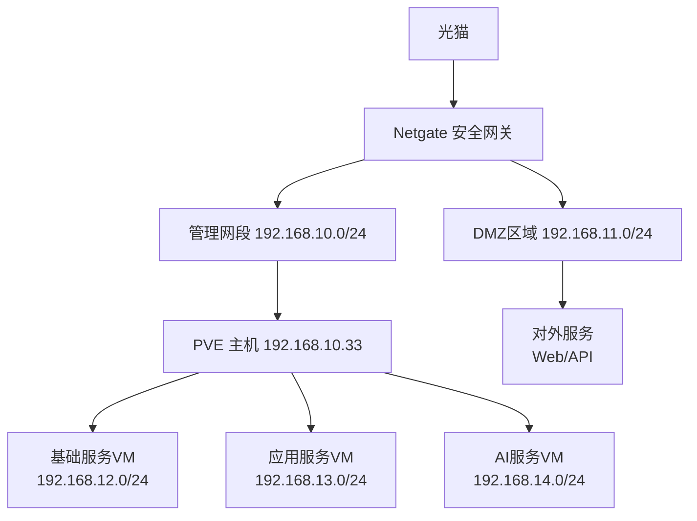

## 项目概述

本指南详细介绍了基于Proxmox VE (PVE)虚拟化平台的家庭实验室网络架构设计与实施方案，致力于构建一个简单、安全、可靠的网络环境。通过合理的网络分段、安全策略和容器化部署，实现高效的资源管理和服务隔离。

## 网络环境架构设计

### 整体网络拓扑



### 网络分段策略

```yaml
# 建议统一网络命名规范
networks:
  mgmt: 192.168.10.0/24    # 管理网络
  dmz: 192.168.11.0/24     # DMZ区域  
  base: 192.168.12.0/24    # 基础服务
  app: 192.168.13.0/24     # 应用服务
  ai: 192.168.14.0/24      # AI服务
```

#### 1. 管理网段 (192.168.10.0/24)

- **用途**: PVE主机管理、路由器管理、网络设备
- **安全级别**: 高
- **访问控制**: 仅管理员网络访问
- **设备**:
  - PVE主机: 192.168.10.33
  - 网关: 192.168.10.2
  - DNS: 114.114.114.114, 8.8.8.8

#### 2. DMZ区域 (192.168.11.0/24)

- **用途**: 对外提供服务的资源
- **安全级别**: 中
- **访问控制**: 有限的外网访问
- **服务**: Web服务、API网关、反向代理

#### 3. 基础服务网段 (192.168.12.0/24)

- **用途**: 数据库、DDNS、监控等基础设施
- **安全级别**: 高
- **访问控制**: 仅内网访问
- **服务**:
  - 数据库集群
  - DDNS服务
  - 监控系统
  - 日志收集

#### 4. 应用服务网段 (192.168.13.0/24)

- **用途**: 日常应用服务
- **安全级别**: 中
- **访问控制**: 内网 + 受控外网访问
- **服务**:
  - 笔记系统
  - 日历应用
  - 文件存储
  - 媒体服务

#### 5. AI服务网段 (192.168.14.0/24)

- **用途**: AI模型、机器学习环境
- **安全级别**: 中
- **访问控制**: 内网访问
- **服务**:
  - Jupyter Lab
  - Ollama AI模型
  - GPU计算资源

### 安全策略设计

#### 防火墙规则

```yaml
# Netgate防火墙规则示例
rules:
  # 管理网段保护
  - from: any
    to: 192.168.10.0/24
    ports: [22, 8006]
    action: allow
    condition: source_in_admin_network
  
  # 服务间通信
  - from: 192.168.13.0/24
    to: 192.168.12.0/24
    ports: [3306, 5432, 6379]
    action: allow
    
  # DMZ访问控制
  - from: internet
    to: 192.168.11.0/24
    ports: [80, 443]
    action: allow
    
  # 默认拒绝
  - from: any
    to: any
    action: deny
```

#### 网络隔离措施

1. **VLAN隔离**: 不同服务网段使用独立VLAN
2. **微分段**: 容器间网络隔离
3. **访问控制列表**: 精确控制服务间通信
4. **流量监控**: 实时监控异常网络行为

### 高可用性设计

#### 1. 网络冗余

- 双网卡绑定(Bond)提供链路冗余
- 多路径网络确保服务连续性

#### 2. 服务冗余

- 关键服务多实例部署
- 负载均衡分散请求压力
- 自动故障转移机制

#### 3. 数据备份

- 定期数据备份到外部存储
- 配置文件版本控制
- 灾难恢复预案

### 网络监控与管理

#### 监控指标

- 网络带宽使用率
- 连接数统计
- 延迟监测
- 安全事件告警

#### 管理工具

- PVE Web界面统一管理
- Prometheus + Grafana监控
- ELK日志分析
- 自动化部署脚本

### 网络配置建议

#### PVE网络桥接配置

```bash
# 创建网络桥接
auto vmbr0
iface vmbr0 inet static
    address 192.168.10.33/24
    gateway 192.168.10.2
    bridge-ports ens18
    bridge-stp off
    bridge-fd 0

# 服务专用网桥
auto vmbr1
iface vmbr1 inet static
    address 192.168.12.1/24
    bridge-ports none
    bridge-stp off
    bridge-fd 0

auto vmbr2  
iface vmbr2 inet static
    address 192.168.13.1/24
    bridge-ports none
    bridge-stp off
    bridge-fd 0

auto vmbr3
iface vmbr3 inet static
    address 192.168.14.1/24
    bridge-ports none
    bridge-stp off
    bridge-fd 0
```

#### 安全加固建议

1. **网络访问控制**
   - 启用SSH密钥认证，禁用密码登录
   - 配置fail2ban防止暴力破解
   - 定期更新安全补丁

2. **服务隔离**
   - 使用Docker网络隔离容器
   - 最小权限原则分配资源
   - 定期安全审计

3. **数据保护**
   - 启用磁盘加密
   - 配置定期备份策略
   - 实施访问日志记录

#### 性能优化建议

1. **网络优化**
   - 启用网卡中断负载均衡
   - 调整TCP缓冲区大小
   - 配置网络队列优化

2. **存储优化**
   - 使用SSD存储系统盘
   - 配置适当的I/O调度器
   - 启用存储缓存策略

## 操作系统准备

### 软件更新

```bash
sudo apt-get update && \
sudo apt-get install g++ && \
sudo apt-get install gcc && \
sudo apt-get install make
```

### 磁盘配置

```bash
sudo lvresize -l +85%FREE /dev/mapper/ubuntu--vg-ubuntu--lv
```

### 网络设置

```yaml
network:
  version: 2
  ethernets:
    ens18:
      dhcp4: no # 关闭IPV4 DHCP
      dhcp6: no # 关闭IPV6 DHCP
      addresses:
        - 192.168.10.33/24    # IP
      routes:
        - to: default
          via: 192.168.10.2   # 网关
      nameservers:            # DNS
        addresses:
          - 114.114.114.114
          - 8.8.8.8
```

### 网络存储配置

```bash
sudo mount -t cifs //192.168.10.2/kaken /mnt/ndisk

# 自动加载 mount
sudo vim /etc/fstab

//192.168.10.2/kaken /mnt/ndisk cifs guest,uid=1000,gid=1000,iocharset=utf8,file_mode=0777,dir_mode=0777 0 0

sudo mount -t cifs //192.168.10.2/kaken /mnt/ndisk -o guest,uid=$(id -u),gid=$(id -g)

```

### Docker 安装配置

参考：[Docker官方安装文档](https://docs.docker.com/engine/install/ubuntu/#install-using-the-repository)

#### 卸载已存在的 Docker

1. 卸载 Docker Engine, CLI, containerd 和 Docker Compose 包：

```bash
sudo apt-get purge docker-ce docker-ce-cli containerd.io docker-buildx-plugin docker-compose-plugin docker-ce-rootless-extras
```

2. 删除所有镜像、容器和数据卷：

```bash
sudo rm -rf /var/lib/docker
sudo rm -rf /var/lib/containerd
```

3. 移除源列表和密钥：

```bash
sudo rm /etc/apt/sources.list.d/docker.list
sudo rm /etc/apt/keyrings/docker.asc
```

**注意**: 需要手动删除任何编辑过的配置文件。

#### 安装

##### 卸载所有包配置

```bash
# uninstall all conflicting packages
for pkg in docker.io docker-doc docker-compose docker-compose-v2 podman-docker containerd runc; do sudo apt-get remove $pkg; done
```

##### 使用 apt 安装

1. 添加 Docker 官方 GPG key

```bash
sudo apt-get update
sudo apt-get install ca-certificates curl
sudo install -m 0755 -d /etc/apt/keyrings
sudo curl -fsSL https://download.docker.com/linux/ubuntu/gpg -o /etc/apt/keyrings/docker.asc
sudo chmod a+r /etc/apt/keyrings/docker.asc
```

2. 添加 Docker 源

```bash
echo \
  "deb [arch=$(dpkg --print-architecture) signed-by=/etc/apt/keyrings/docker.asc] https://download.docker.com/linux/ubuntu \
  $(. /etc/os-release && echo "${UBUNTU_CODENAME:-$VERSION_CODENAME}") stable" | \
  sudo tee /etc/apt/sources.list.d/docker.list > /dev/null
sudo apt-get update
```

3. 安装 Docker 包

```bash
sudo apt-get install docker-ce docker-ce-cli containerd.io docker-buildx-plugin docker-compose-plugin
```

4. hello-world 镜像运行验证

```bash
sudo docker run hello-world
```

#### 配置源 + nvidia-container-runtime

```bash
sudo tee /etc/docker/daemon.json <<-'EOF'
{
    "registry-mirrors": [
        "https://docker.m.daocloud.io",
        "https://docker.ducust.site",
        "https://ghcr.io",
        "http://mirror.azure.cn",
        "https://dockerpull.org"
    ],
    "runtimes": {
        "nvidia": {
            "args": [],
            "path": "nvidia-container-runtime"
        }
    }
}
EOF
```

### 容器服务安装与网络配置

#### 网络安全配置

在部署容器服务前，建议先配置Docker网络安全策略：

```bash
# 创建自定义网络
docker network create --driver bridge \
  --subnet=192.168.12.0/24 \
  --gateway=192.168.12.1 \
  base-network

docker network create --driver bridge \
  --subnet=192.168.13.0/24 \
  --gateway=192.168.13.1 \
  app-network

docker network create --driver bridge \
  --subnet=192.168.14.0/24 \
  --gateway=192.168.14.1 \
  ai-network
```

#### 基础服务部署 (BASE)

```bash
# 创建基础服务网络
docker network create base-services

# 自动更新看门狗 - 限制网络访问
docker run --detach \
  --name watchtower \
  --network base-services \
  --volume /var/run/docker.sock:/var/run/docker.sock \
  --restart always \
  -e WATCHTOWER_CLEANUP=true \
  -e WATCHTOWER_SCHEDULE="0 0 2 * * *" \
  containrrr/watchtower --interval 1800 --cleanup

# PostgreSQL 数据库 - 内网访问
docker run -d \
  --name postgres \
  --network base-services \
  --restart unless-stopped \
  -e POSTGRES_DB=homelab \
  -e POSTGRES_USER=admin \
  -e POSTGRES_PASSWORD=secure_password \
  -v postgres_data:/var/lib/postgresql/data \
  postgres:15-alpine

# Redis 缓存 - 内网访问
docker run -d \
  --name redis \
  --network base-services \
  --restart unless-stopped \
  -v redis_data:/data \
  redis:7-alpine redis-server --appendonly yes

# 监控系统 Prometheus
docker run -d \
  --name prometheus \
  --network base-services \
  --restart unless-stopped \
  -p 9090:9090 \
  -v prometheus_config:/etc/prometheus \
  -v prometheus_data:/prometheus \
  prom/prometheus

```

#### 应用服务部署 (APP)

```bash
# 创建应用服务网络
docker network create app-services

# 自动更新看门狗
docker run --detach \
  --name watchtower-app \
  --network app-services \
  --volume /var/run/docker.sock:/var/run/docker.sock \
  --restart always \
  containrrr/watchtower --interval 1800 --cleanup

# DDNS ddns-go 服务 - 安全配置
docker run -d \
  --name ddns-go \
  --restart=always \
  --network app-services \
  -p 9876:9876 \
  -v ~/ddns-go:/root \
  -e DDNS_PROVIDER=cloudflare \
  ghcr.io/jeessy2/ddns-go

# 反向代理服务
sudo docker run -d \
  --name zoraxy \
  --restart unless-stopped \
  --network app-services \
  --add-host=host.docker.internal:host-gateway \
  -p 80:80 \
  -p 443:443 \
  -p 8000:8000 \
  -v /home/atovk/zoraxy/config/:/opt/zoraxy/config/ \
  -v /home/atovk/zoraxy/plugin/:/opt/zoraxy/plugin/ \
  -v /var/run/docker.sock:/var/run/docker.sock \
  -v /etc/localtime:/etc/localtime \
  -e FASTGEOIP="true" \
  zoraxydocker/zoraxy:latest
```

#### AI服务部署 (AI)

```bash
# 创建AI服务网络
docker network create ai-services

# 自动更新看门狗
docker run --detach \
  --name watchtower-ai \
  --network ai-services \
  --volume /var/run/docker.sock:/var/run/docker.sock \
  --restart always \
  containrrr/watchtower --interval 1800 --cleanup

# Ollama - GPU支持与安全配置
docker run -d \
  --gpus=all \
  --name ollama \
  --network ai-services \
  --restart unless-stopped \
  -v /mnt/ndisk/.ollama:/root/.ollama \
  -p 11434:11434 \
  -e OLLAMA_HOST=0.0.0.0 \
  ollama/ollama

# Jupyter Lab - 安全配置
docker run -d \
  --name jupyter \
  --network ai-services \
  --restart unless-stopped \
  -p 8888:8888 \
  -v jupyter_data:/home/jovyan/work \
  -e JUPYTER_ENABLE_LAB=yes \
  -e JUPYTER_TOKEN=secure_token_here \
  jupyter/tensorflow-notebook:latest

# Open WebUI - Ollama前端界面
docker run -d \
  --name open-webui \
  --network ai-services \
  --restart unless-stopped \
  -p 3001:8080 \
  -v open_webui_data:/app/backend/data \
  -e OLLAMA_BASE_URL=http://ollama:11434 \
  ghcr.io/open-webui/open-webui:main

# 获取AI模型 - 安全下载
docker exec -it ollama ollama pull qwen2.5:latest
docker exec -it ollama ollama pull llama3.2:latest
docker exec -it ollama ollama pull nomic-embed-text:latest

# 测试API连接 - 内网访问
curl http://localhost:11434/api/chat -d '{
  "model": "qwen2.5",
  "messages": [
    { "role": "user", "content": "请介绍一下网络安全的重要性" }
  ]
}'

```

#### 网络安全监控

```bash
# 网络流量监控
docker run -d \
  --name netdata \
  --restart unless-stopped \
  --network host \
  -v /proc:/host/proc:ro \
  -v /sys:/host/sys:ro \
  -v /var/run/docker.sock:/var/run/docker.sock:ro \
  --cap-add SYS_PTRACE \
  --security-opt apparmor=unconfined \
  netdata/netdata

# 容器安全扫描
docker run --rm \
  -v /var/run/docker.sock:/var/run/docker.sock \
  aquasec/trivy image --severity HIGH,CRITICAL ollama/ollama
```

## 网络安全最佳实践

### 定期维护任务

#### 1. 安全更新

```bash
# 系统更新脚本
#!/bin/bash
# update_system.sh

# 更新系统包
sudo apt update && sudo apt upgrade -y

# 更新Docker镜像
docker images --format "table {{.Repository}}:{{.Tag}}" | \
grep -v "REPOSITORY" | \
xargs -I {} docker pull {}

# 清理无用镜像
docker image prune -f

# 检查容器健康状态
docker ps --format "table {{.Names}}\t{{.Status}}\t{{.Ports}}"
```

#### 2. 备份策略

```bash
# 自动备份脚本
#!/bin/bash
# backup_config.sh

BACKUP_DIR="/mnt/ndisk/backups/$(date +%Y-%m-%d)"
mkdir -p $BACKUP_DIR

# 备份Docker配置
docker run --rm -v docker_volumes:/volumes \
  -v $BACKUP_DIR:/backup alpine \
  tar czf /backup/docker_volumes.tar.gz -C /volumes .

# 备份网络配置
cp /etc/netplan/*.yaml $BACKUP_DIR/
cp /etc/docker/daemon.json $BACKUP_DIR/

# 备份PVE配置
cp -r /etc/pve $BACKUP_DIR/ 2>/dev/null || true

echo "备份完成: $BACKUP_DIR"
```

#### 3. 监控告警

```bash
# 系统监控脚本
#!/bin/bash
# monitor_system.sh

# 检查磁盘使用率
DISK_USAGE=$(df / | awk 'NR==2 {print $5}' | sed 's/%//')
if [ $DISK_USAGE -gt 80 ]; then
    echo "警告: 磁盘使用率超过80%: $DISK_USAGE%"
fi

# 检查内存使用
MEM_USAGE=$(free | awk 'NR==2 {printf "%.0f", $3/$2*100}')
if [ $MEM_USAGE -gt 85 ]; then
    echo "警告: 内存使用率超过85%: $MEM_USAGE%"
fi

# 检查容器状态
UNHEALTHY=$(docker ps --filter "health=unhealthy" -q | wc -l)
if [ $UNHEALTHY -gt 0 ]; then
    echo "警告: 有 $UNHEALTHY 个容器状态异常"
fi
```

### 故障排除指南

#### 网络连接问题

1. **检查网络配置**

   ```bash
   # 检查网络接口
   ip addr show
   
   # 检查路由表
   ip route show
   
   # 测试网络连通性
   ping -c 3 192.168.10.2
   ```

2. **Docker网络问题**

   ```bash
   # 查看Docker网络
   docker network ls
   
   # 检查容器网络配置
   docker inspect <container_name> | grep -A 10 NetworkSettings
   
   # 重建Docker网络
   docker network prune
   ```

#### 容器服务问题

1. **查看容器日志**

   ```bash
   docker logs -f <container_name>
   ```

2. **重启服务**

   ```bash
   docker restart <container_name>
   ```

3. **资源使用检查**

   ```bash
   docker stats
   ```

### 扩展建议

#### 1. 高级安全配置

- 部署Web应用防火墙(WAF)
- 配置入侵检测系统(IDS)
- 实施零信任网络架构

#### 2. 性能优化

- 使用CDN加速静态资源
- 配置数据库读写分离
- 实施缓存策略优化

#### 3. 可观测性增强

- 部署APM性能监控
- 配置分布式链路追踪
- 实施日志聚合分析

## 总结

本指南提供了一个完整的家庭实验室网络架构设计方案，重点关注：

1. **简单性**: 清晰的网络分段和标准化的部署流程
2. **安全性**: 多层次的安全防护和访问控制
3. **可靠性**: 冗余设计和自动化运维

通过遵循这些设计原则和最佳实践，您可以构建一个稳定、安全、易于管理的家庭实验室环境。记住定期备份配置文件、更新系统补丁，并监控系统运行状态，以确保环境的长期稳定运行。

---

最后更新: 2025年8月
